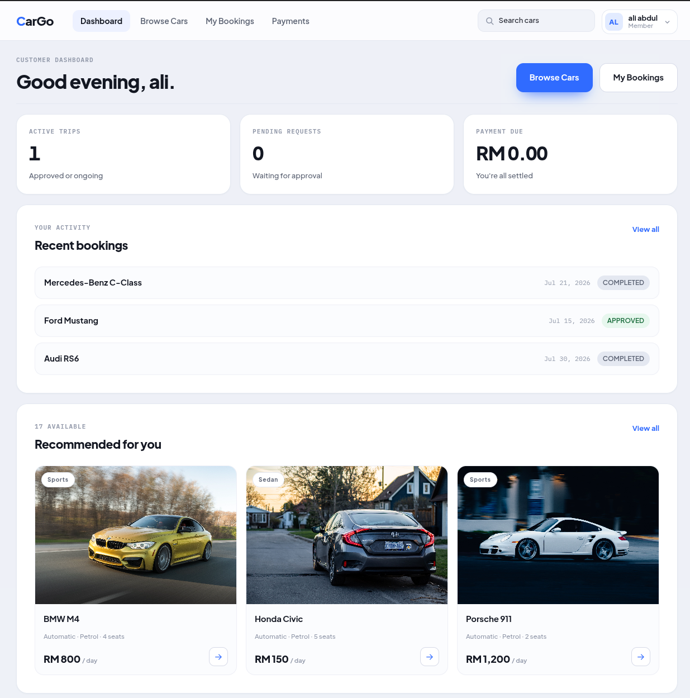
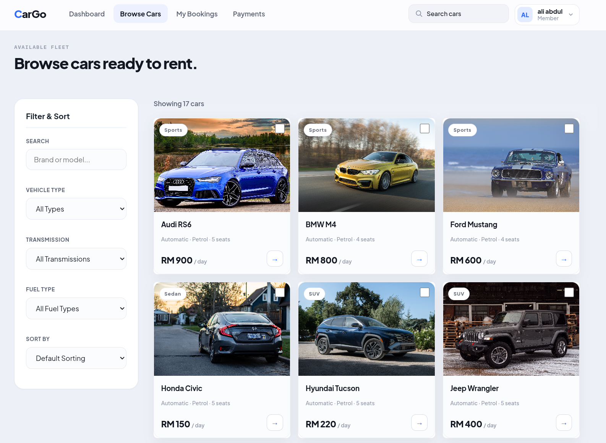
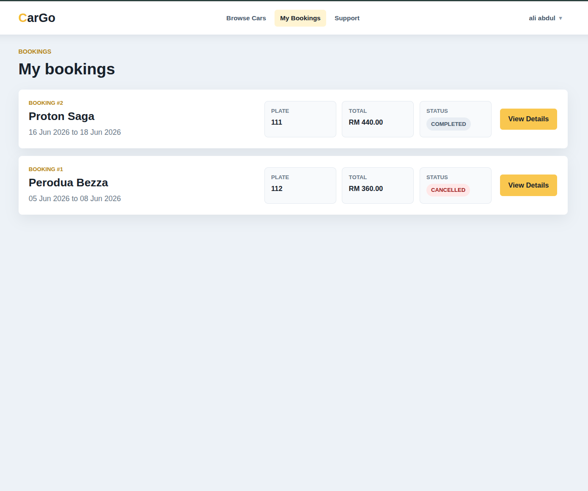
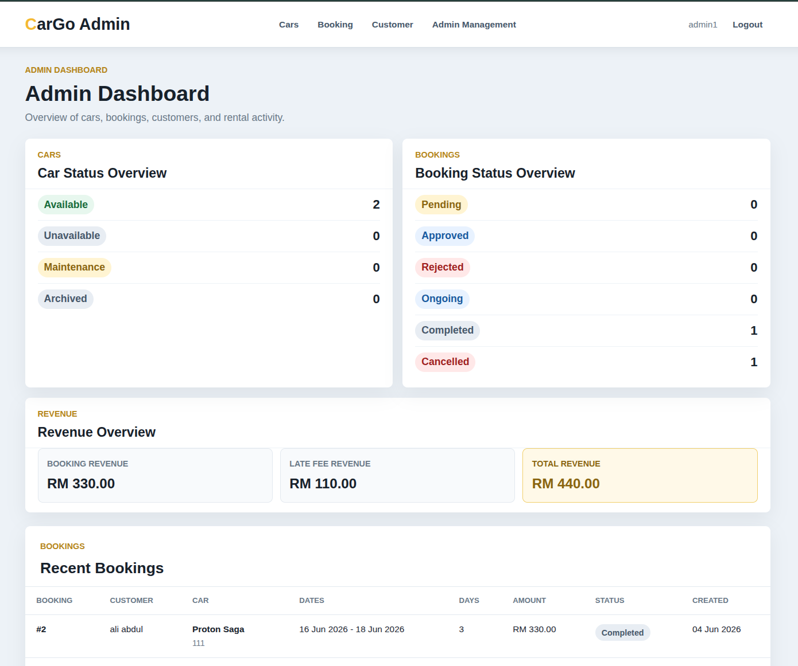
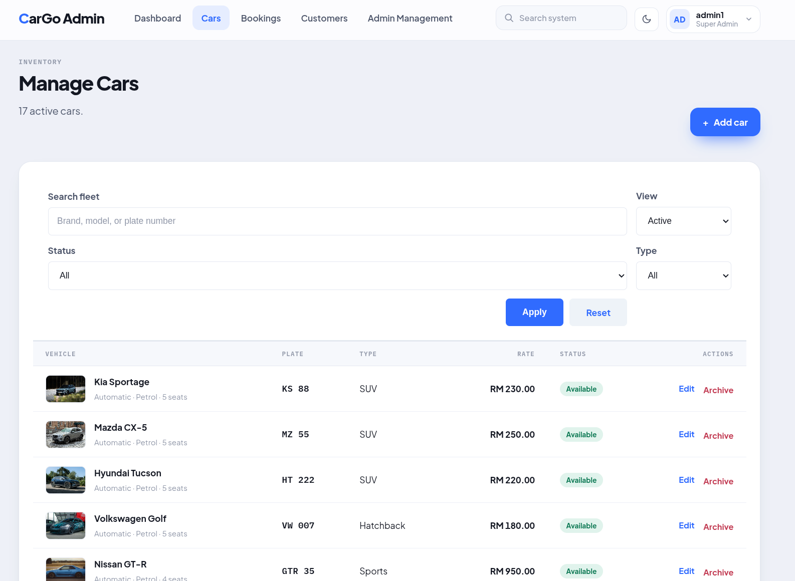
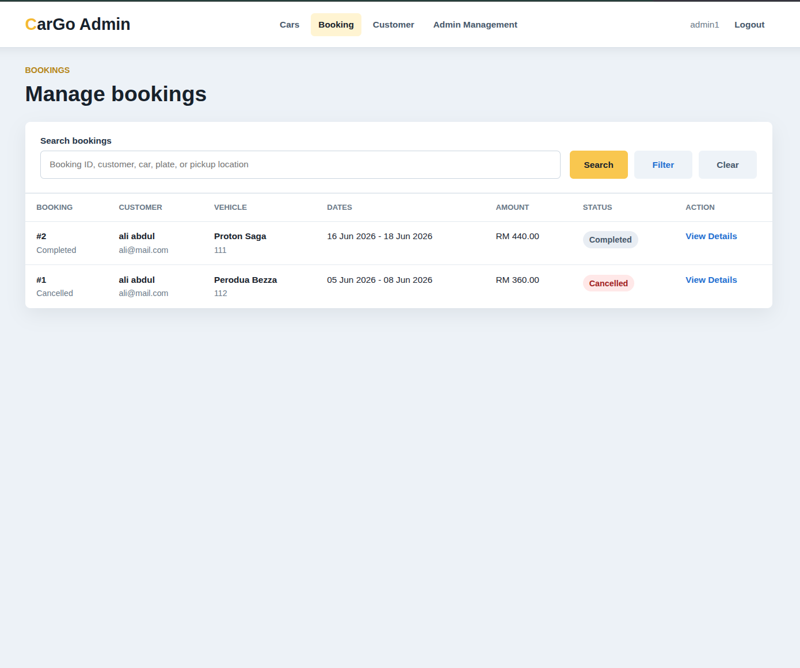
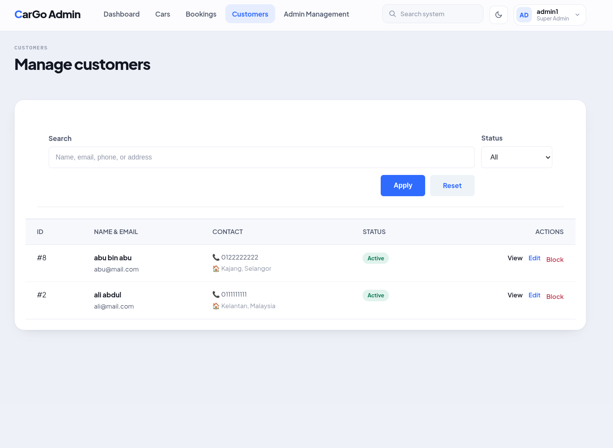
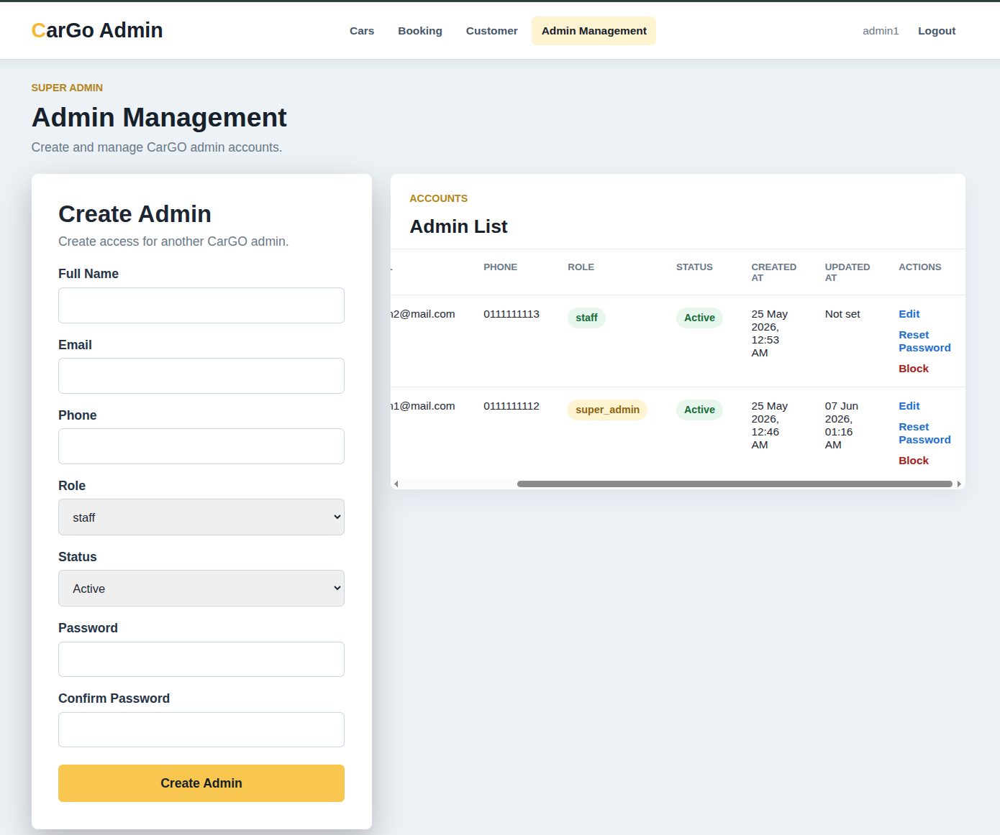

# CarGO Car Rental Management System

Website Preview: [cargo.site.je](https://cargo.site.je)

CarGO is a PHP and MySQL car rental management system for customers and administrators. Customers can browse available cars, create and manage bookings, pay bookings, and update their profile. Admin users can manage cars, bookings, customers, dashboard reporting, and admin accounts.

## Preview

| Customer Dashboard | Customer Booking | Customer Booking Record |
| --- | --- | --- |
|  |  |  |

| Admin Dashboard | Admin Cars | Admin Booking |
| --- | --- | --- |
|  |  |  |

| Admin Customer | Admin Management |
| --- | --- |
|  |  |

## Features

- Customer registration, login, profile update, and password change.
- Customer car browsing, availability checks, booking creation, payment, cancellation, and booking history.
- Admin dashboard with fleet, booking, customer, and revenue overview.
- Admin car management with add, edit, image upload, and soft archive.
- Admin booking management with search, filters, pickup confirmation, return confirmation, and late fee handling.
- Customer management with search, filtering, edit, block, and unblock.
- Super admin account management for admin users, roles, status, and password reset.
- Security helpers for prepared statements, CSRF protection, safer sessions, POST-only logout, and active-account checks.

## Tech Stack

- PHP 8.1+ (procedural, mysqli with prepared statements)
- MySQL / MariaDB
- GD (image resizing, WebP/JPEG derivative generation)
- HTML, CSS, vanilla JavaScript
- Docker + Docker Compose (local dev)
- Composer (`vlucas/phpdotenv`; dev: PHPUnit, PHPStan, PHP_CodeSniffer)
- Hosted on InfinityFree (shared hosting)

## Project Structure

```text
CarGO/
├── admin/              # Admin pages and admin auth helpers
├── asset/              # README screenshots, car image placeholder
├── car/                # Uploaded car images and generated WebP/JPEG derivatives
├── css/                # Admin and customer page styles
├── customer/           # Customer pages and customer auth helpers
├── database/           # migrate.php runner and its .sql migration files
├── includes/           # Shared security, session, and layout helpers
├── js/                 # Browse/booking filter UI scripts
├── scripts/            # One-time CLI maintenance scripts (image backfill)
├── tests/              # PHPUnit test suite
├── util/               # Shared booking, payment, car image, and archive helpers
├── composer.json        # Dependencies and eager-autoloaded helper files
├── db_connect.php       # Database connection (env vars or config.local.php)
├── docker-compose.yml   # Local app + MariaDB stack
├── Dockerfile            # PHP/Apache image with GD, WebP, and caching config
├── index.php             # Entry redirect/page
├── logout.php            # POST-only logout endpoint
└── phpunit.xml            # Test runner config
```

## Setup

### Local development: Docker

1. Ensure **Docker** and **Docker Compose** are installed.
2. Run the following command in the project root to start the containers:
   ```bash
   docker-compose up -d --build
   ```
3. Wait about 10-15 seconds for the MySQL database to initialize.
4. Run the database migrations:
   ```bash
   docker-compose exec app php database/migrate.php
   ```
5. Open your browser and navigate to `http://localhost:8888`.

For more details, see [RUN_GUIDE.md](RUN_GUIDE.md).

### Hosting: InfinityFree

The live site runs on [InfinityFree](https://infinityfree.net) shared hosting.

1. Upload the project files to the account's `htdocs/` via FTP.
2. Create the MySQL database from the InfinityFree control panel and run the migrations in
   `database/` against it (`database/migrate.php` or the individual `.sql` files).
3. Set DB credentials via `config.local.php` (see `db_connect.php`) rather than committing them.
4. GD's WebP support and `.htaccess`'s `mod_expires`/`mod_headers`/`mod_deflate` rules depend on
   what the host has enabled; `util/car_image.php` falls back to a plain copy/no derivatives when
   GD or WebP aren't available, so the upload path still works either way.
5. Shared hosting has a low memory ceiling — `CAR_IMAGE_DECODE_CEILING_BYTES` in
   `util/car_image.php` is tuned for that; only raise it via `CARGO_DECODE_CEILING_MB` on
   hosts you know can handle it.

## Security Notes

- All SQL uses prepared statements (`mysqli` bound params); see `util/` and `admin/`/`customer/` pages.
- CSRF tokens are required on every state-changing POST (`includes/security.php`:
  `csrfToken()`, `requireValidCsrfToken()`); logout is POST-only.
- Sessions use strict mode, `HttpOnly`, `SameSite=Lax`, and `Secure` when served over HTTPS
  (`startSecureSession()`); the CSRF token and session ID both regenerate on login.
- Customer and admin accounts are re-checked against their current DB status
  (`requireCustomerLogin()`, `requireAdminLogin()`) on every protected page, so a blocked or
  deleted account loses access immediately rather than on next login.
- Passwords are stored with `password_hash()` / `password_verify()`; only super admins can
  create/edit other admin accounts (`requireSuperAdmin()`).
- Uploaded car images are validated by MIME type, size, and decoded resolution before being
  written to disk (`processCarImageUpload()`), and derivative/original file paths are checked
  against directory traversal before any filesystem write or delete.

## Notes

- Run `php test.php` (or `vendor/bin/phpunit`, `vendor/bin/phpstan analyze --level=4`,
  `vendor/bin/phpcs --standard=PSR12`) before committing changes to `util/` or `includes/`.
- `car/` holds both the uploaded originals and their generated `-400`/`-800` JPEG+WebP
  derivatives; `scripts/optimize_existing_car_images.php` is a one-time CLI backfill for
  images that predate the derivative pipeline — safe to re-run.
- `database/migrate.php` is idempotent and tracks what's already applied in `migrations_log`;
  run it again after pulling changes that add a new `.sql` file under `database/`.
- Add screenshots or database diagrams to the Preview section when preparing the final report.
